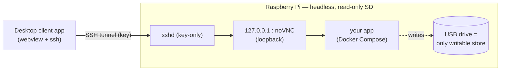

# rpi-appliance

Turn a Raspberry Pi into a **secure, headless appliance** that runs one
containerized GUI app — reachable from a single trusted computer, over an
authenticated SSH tunnel, with **nothing exposed on your network**.

It comes in two parts:

- **A flashable Pi image** — standard and app-agnostic. You pick the app *after*
  flashing by dropping a `compose.yml` into one config folder; the image stays the
  same for everyone.
- **A cross-platform desktop client** — opens the SSH tunnel in the background and
  renders the app's GUI as a native window. One click in, one click out.

> **Status:** early development. The appliance-image host stack (Phases 1–6) is
> implemented and tested off-Pi; the pi-gen image build + CI (Phase 7) is in place and
> builds in CI. On-hardware validation and the CNC acceptance test are
> [Phase 8](specs/initiatives/appliance-image/roadmap.md). The desktop client is a
> separate, later initiative.

## Why

Plenty of great desktop GUI apps would be useful on a headless Pi — but the usual
setups leave the GUI (and often SSH with a default password) open to everyone on the
LAN. `rpi-appliance` flips that: services bind to loopback only, SSH is key-only,
and the **one computer holding the key** is the only thing that can reach in.

**Motivating example — operating a CNC machine over GRBL.** The control software is
a desktop GUI app, but bolting a monitor/keyboard onto the machine is impractical,
so a headless Pi runs it. You drive it wirelessly from the shop computer you already
have, in one click — while no one else on the network can pause, stop, or disturb a
running job. The toolkit stays generic, though: the CNC controller is just one app
you could run on top of it.

## How it works

- **One key, one computer.** The SSH key is the single gate — for the GUI, files,
  and shutdown alike. No web password, no open ports, no default credentials.
- **Physical presence is trusted; the network is not.** Anyone at the machine (USB,
  power) is already trusted; the boundary we enforce is *remote* access.
- **Power-loss resilient.** The SD root is read-only; a **required USB drive** holds
  all data, so a yanked power cord can't corrupt the system or lose your work.
- **Customize after flashing.** One boot-partition folder holds everything you edit:
  `wifi.txt`, `setup.txt` (your one-off setup password or public key), and
  `compose.yml` (the app to run, including any USB device passthrough).

## Flashing & first boot

1. **Get the image.** Build it with [`appliance/image/build.sh`](appliance/image/build.sh)
   (Linux + Docker), or download the `.img.xz` artifact from the `build-image` CI run.
2. **Flash** it to an SD card (Raspberry Pi Imager, `dd`, etc.).
3. **Edit the one config folder** on the boot partition (`/appliance`, FAT — editable
   on any computer). Samples are in [`appliance/boot-config-sample/`](appliance/boot-config-sample/):
   - `wifi.txt` — SSID/password/country (delete it for wired Ethernet).
   - `setup.txt` — your SSH **public key** (recommended) or a one-off `password=…`.
   - `compose.yml` — the app to run (label the GUI service `appliance.gui: "true"`).
4. **Plug in a USB drive** formatted **ext4** and labelled **`APPLIANCE`** — it is
   required and holds all data (the app won't start without it).
5. **Boot.** First boot joins the network, provisions access, and starts the app,
   writing a `setup.log` to the boot partition (readable by pulling the SD if you
   can't connect yet).
6. **Connect** (until the desktop client ships): tunnel the loopback noVNC port and
   open it in a browser —
   `ssh -i <key> -L 5800:127.0.0.1:5800 pi@<appliance-host>` then <http://localhost:5800>.

The standard image ships **no app** — `compose.yml` points at your own image. The dev
sample (Candle, an open GRBL sender) lives in [`appliance/sample-app/`](appliance/sample-app/)
for testing the plumbing off-Pi.

## Client app platforms

The desktop client targets **macOS, Windows, and Linux** and is built for all three
in CI. Note: the author can currently hardware-test only on **macOS** — Windows and
Linux are best-effort / community-validated until confirmed.

## License & third-party software

This project is **MIT licensed** (see [LICENSE](LICENSE)). Its dependencies are
permissively licensed (`jlesage/baseimage-gui` MIT; Tauri MIT/Apache-2.0; pi-gen
produces redistributable Raspberry Pi OS).

**The standard image ships no application software.** The app you run is supplied at
runtime via your own `compose.yml`. If that app is proprietary (for example, Carbide
Motion), its license is **your responsibility** — it is never bundled in or
distributed by this repo.

## Development

This repo follows spec-driven development; see [`AGENTS.md`](AGENTS.md) for the
workflow and [`specs/`](specs/) for the mission, tech stack, and roadmap.
