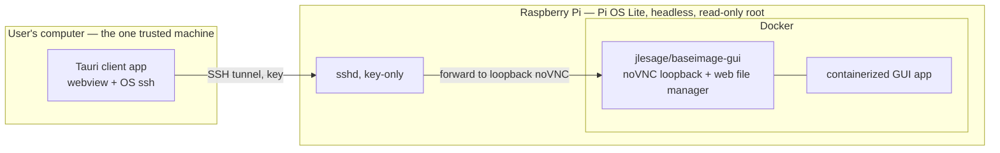

# Tech Stack

## System Design

Two components in one repo. The **appliance** is a flashable Raspberry Pi image
(Raspberry Pi OS Lite, headless) that auto-boots Docker and runs one containerized
GUI app on the `jlesage/baseimage-gui` base, which exposes the app's GUI as noVNC
plus an in-browser web file manager. Every service binds to **loopback only** — the
GUI is never offered on the LAN. SSH is **key-only**. The **client** is a
cross-platform Tauri desktop app on the user's computer: it opens an SSH local
port-forward to the appliance's noVNC port, renders that URL in its webview as a
native window, and also drives setup (key generation/provisioning) and shutdown
over the same SSH channel. The SSH tunnel is the sole access path and the sole
auth boundary.

The SD card root is **read-only** (overlayfs); a **USB drive is required** and is
the single writable store — all app data and compose volumes live there, so an
abrupt power cut cannot corrupt the system or lose data. The image itself is
**standard and app-agnostic** — one published image for everyone. "Which app" is **not** baked at build time; it is declared *post-flash* as
data: a `compose.yml` the user drops into a single boot-partition folder. On first
boot the appliance runs it, while enforcing the security invariants itself (the GUI
port is always bound to loopback regardless of what the compose declares). Baking an
app in at build time stays available as an optional turnkey convenience, but is not
the default path.

## Stack Choices

- **Host OS:** Raspberry Pi OS Lite — headless; the GUI lives in the container.
- **Image builder:** pi-gen (run in Docker) — official, scriptable, reproducible.
- **Container base:** `jlesage/baseimage-gui` — a widely-used base for delivering
  X11/Qt desktop apps to the browser via noVNC, with a built-in web file manager
  (it backs jlesage's published app images such as JDownloader2, Firefox, etc.).
  Chosen so we inherit proven GUI-over-web plumbing rather than building it.
- **Container runtime:** Docker — one container, systemd-autostarted on boot.
- **Access transport:** OpenSSH local port-forward — the tunnel is auth + transport
  in one; no extra daemon, fully offline. Uses the **OS-provided `ssh`** on both
  ends (built into macOS, Linux, and Windows 10+).
- **Client app:** Tauri (Rust + OS webview) — a real cross-platform app that is lean
  (OS webview, not bundled Chromium) and shells out to the OS `ssh` rather than
  bundling an SSH stack.
- **Read-only root:** Raspberry Pi OS overlayfs mode — power-loss resilience with
  stock tooling; the SD has nothing writable to corrupt.
- **Writable storage:** a **required** USB drive (ext4, auto-mounted by label/UUID
  via `/etc/fstab`) — the single read/write surface, holding app data and compose
  volumes. If it's absent at boot, the appliance does not start the app and records
  why in the setup log (it's a hard requirement, not optional).
- **Setup auth:** user-chosen one-off password in a boot-partition file (single-use,
  disabled after key provisioning) **or** a pre-placed public key. No default
  credential ever ships.
- **App deployment:** a `compose.yml` in the boot-partition config folder, run on
  first boot — Docker Compose because it declaratively covers images, volumes,
  devices, and env, and is a format users already know. The appliance overrides any
  port publishing to bind the GUI to loopback only.
- **USB peripheral passthrough:** declared in the same `compose.yml` — targeted
  `devices:` + `group_add` (`dialout`/`input`) + a read-only `/run/udev` mount when
  paths are known; `privileged: true` + `/dev` + `/run/udev` as the documented
  escape hatch for hotplug/unstable enumeration (serial adapters flip
  `ttyUSB*`/`ttyACM*`). The image guarantees the host side (udev running, group
  membership). This is **local-only access and orthogonal to the network boundary** —
  it requires physically connecting the device, which is already trusted.

## Data Model Overview

No database. The shapes that matter:

- **Boot-partition config folder** (FAT, editable on any computer after flashing) —
  a single folder holding *everything the user touches*: `wifi.txt` (network),
  `setup.txt` (one-off password or public key), and `compose.yml` (the app to run).
  Nothing user-editable lives outside this one folder.
- **Appliance SSH state:** `authorized_keys` (the trusted computer's public key);
  `sshd_config` flips to `PasswordAuthentication no` after provisioning.
- **Client config (on the user's computer):** appliance hostname/address, noVNC
  port, path to the private key. The private key never leaves this computer.
- **USB writable store** (ext4, required): the only read/write surface — holds the
  app's persisted data and all compose volumes. Reached through the web file manager
  over the tunnel; survives reflashing the SD.
- **Setup log:** a plain-text first-boot/setup diagnostic on the boot partition
  (readable by pulling the SD). Scoped to the setup phase only — once the appliance
  is reachable, runtime logs come from the journal / `docker logs`, not persisted.

## Interfaces

- **Client app:** the primary surface — connect, render GUI, settings, first-time
  setup (generate/push key, lock down), shutdown.
- **noVNC GUI + web file manager:** served by the container on a loopback port,
  reached only through the tunnel (and thus only inside the client's webview).
- **SSH:** key-only; the transport for the tunnel and for client-issued commands
  (provisioning, `poweroff`). Not exposed for interactive LAN login by default.
- **Boot-partition files:** the only pre-first-boot configuration surface.

## Configuration

- **Boot-partition config folder** (the primary surface — one folder, editable
  after flashing): `wifi.txt` (SSID/password/country), `setup.txt` (one-off password
  or public key), `compose.yml` (the app, incl. optional device passthrough).
- **Image build args (optional):** hostname and an optional baked-in app for a
  turnkey single-download variant — not needed on the standard path.
- **USB writable store (required):** ext4 drive, auto-mounted by label/UUID via
  `/etc/fstab`; holds app data and compose volumes. App will not start without it.
- **Appliance host:** SSH key-only after provisioning; services bound to
  `127.0.0.1`; overlayfs read-only root toggle.
- **Client:** appliance host/port and private-key path (remembered between runs).

## Testing Strategy

- **Inner loop (fast, off-Pi):** the armhf/arm64 container builds and runs on any
  Docker host — validate noVNC loads and the web file manager works under emulation.
- **Security checks (automated):** assert no service answers on a non-loopback
  interface; assert SSH rejects passwords after provisioning; lint provisioning
  scripts.
- **Client (automated where practical):** unit-test the tunnel/provisioning logic;
  the webview render path is human-validated.
- **Client cross-platform:** the app targets macOS, Windows, and Linux and is built
  for all three in CI. The author can only **hardware-test on macOS**; Windows/Linux
  rely on CI builds plus community validation, so platform-specific paths must avoid
  macOS-only assumptions and be flagged as unverified until someone confirms them.
- **Outer loop (release):** build the full `.img` with pi-gen, flash a Pi, run the
  smoke path: flash → boot → client setup (key push + lockdown) → GUI in the app →
  move a file → shutdown.
- **Resilience:** assert the root is read-only and writes route to the USB; assert
  the app refuses to start (and the setup log says why) when the USB is absent;
  repeated hard power cuts leave the system bootable and USB data intact.
- **Acceptance benchmark (Carbide):** the toolkit is validated end-to-end by the
  original CNC case — flash standard image, drop a Carbide compose with Shapeoko +
  keypad passthrough, set up via the client, drive the machine remotely. This is the
  "done enough" bar for the generic design.
- **On-hardware deferred:** USB enumeration, performance without emulation, real
  power-cut resilience — validated on a Pi, collected into a stabilization phase.

## Dependencies

- pi-gen, Docker, `jlesage/baseimage-gui`, systemd, `yq` (compose sanitize) —
  appliance side.
- OpenSSH (both ends — OS-provided).
- Tauri / Rust toolchain + OS webview (client side).
- **Risk flags:** Tauri build/release per-OS and code-signing/notarization (deferred
  decision — unsigned ships with a documented first-launch step); the brief
  setup-time password window before lockdown (LAN-only, user-chosen, single-use).
- **Licensing (public repo):** the project is MIT. Direct dependencies are
  permissively licensed (`jlesage/baseimage-gui` MIT; Tauri MIT/Apache-2.0; pi-gen
  builds redistributable Raspberry Pi OS). The **standard image ships no application
  software** — the app is supplied at runtime via the user's `compose.yml`, so the
  license of *that* app (e.g. proprietary Carbide Motion) is the consumer's
  responsibility and never lives in this repo. Document this clearly in the README.

## Open Questions

- **Setup-password lifecycle:** is disabling password auth sufficient, or should the
  first-boot script also wipe the password line from the boot partition?
- **Shutdown mechanism:** client-issued `ssh … poweroff` only, or also keep a tiny
  loopback-bound shutdown service as a fallback?
- ~~**Compose security enforcement:**~~ **Resolved (Phase 2):** `compose-up`
  sanitizes the user's compose with `yq` — strips every service's `ports`, then
  republishes only the GUI service (label `appliance.gui=true`, or the sole
  service) as `127.0.0.1:5800`. All other keys pass through untouched, so
  passthrough is unaffected. See `appliance/rootfs/opt/appliance/`.
- **USB store provisioning:** fixed label vs. UUID; whether the appliance formats a
  blank drive on first boot or requires the user to pre-format ext4 with a known
  label; how compose volume paths map onto it.
- **Tauri vs. Go+webview:** Tauri is the default; revisit only if the Rust toolchain
  proves heavy for this small app.
- **Dev-loop emulation:** how much of the client↔appliance flow can be exercised
  without a physical Pi.
